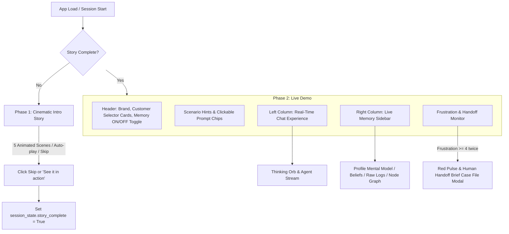

# NetNest UI/UX Redesign Implementation Plan

Redesign the UI/UX presentation layer of **NetNest**—a Streamlit-based broadband customer support demo powered by Hindsight persistent memory—into an award-winning, animation-rich, 60fps dark neon glassmorphic web experience.

> [!IMPORTANT]
> All backend functions (`agent.respond`, `memory.get_profile`, `memory.list_observations`, `memory.list_memories`, `memory.reflect`, and frustration scoring) remain 100% untouched. Only the frontend presentation layer, CSS, and animated HTML components will be rebuilt.

---

## Design System & Aesthetic Foundations

### 1. Color Palette & Theming
- **Dark Base Canvas**: `#0B0B1A` to `#12002B` deep space gradient.
- **Neon Accents**:
  - Electric Violet: `#7C3AED`
  - Hot Pink: `#FF2E93`
  - Hyper Cyan: `#00E5FF`
  - Cyber Lime: `#B6FF3B`
  - Sunset Orange: `#FF8A00`
- **Theme Modes**:
  - **Memory ON**: Cool cyan / electric violet / cyber lime ambient neon glow, particle connections, glowing brain badge.
  - **Memory OFF**: Desaturated dull grey (`#1F2430` / `#4A5568`) and warning crimson (`#FF3B30`) accents to highlight the loss of context.
- **Glassmorphism**: Translucent panels (`rgba(18, 14, 40, 0.65)`), 1px gradient borders (`rgba(255,255,255,0.12)`), `backdrop-filter: blur(16px)`, 24px border radii.

### 2. Typography
- **Headings & Accents**: `Space Grotesk` / `Sora` via Google Fonts.
- **Body & Controls**: `Inter` with subpixel rendering and smooth character tracking.
- **Code & Raw Logs**: `Fira Code` / `JetBrains Mono` for terminal raw memory timelines.

### 3. Motion Principles & Interactive Graphics
- **Particle Node Canvas**: Canvas-driven network graph reacting to mouse movements, connecting node dots with glowing signal lines.
- **Border Beam**: Conic gradient light beam running along container borders and input box (`offset-path` / `conic-gradient` animation), speeding up during agent generation.
- **SVG Gooey Filters**: Gooey liquid knob on Memory toggle, fluid typing indicator dots, and customer avatar transitions.
- **Custom Cursor & Micro-interactions**: Magnetic hover states, soft neon ambient lighting, audio feedback toggle (Web Audio API sound synthesis, off by default).

---

## User Experience Architecture

---

## Proposed Component Architecture

### Component Breakdown

#### 1. Global Styles & Theme System ([styles.css](file:///Users/aksharapaladugu/support-memory-agent/styles.css))
- Full CSS reset, Streamlit default element suppression (`#MainMenu`, `footer`, headers, paddings).
- Dynamic CSS custom properties (`:root` tokens for Memory ON vs Memory OFF).
- Keyframe animations: `border-beam`, `thinking-orb-pulse`, `goo-liquid`, `shimmer-text`, `shake-warning`, `pulse-glow`, `particle-fade`.

#### 2. Phase 1: Cinematic Intro Story ([intro_ui.py](file:///Users/aksharapaladugu/support-memory-agent/intro_ui.py))
Rendered via `st.components.v1.html` with full 60fps animations:
- **Scene 1**: "Every time you call support..." — visual of customer avatar attempting connection with Agent #1, #2, #3 counters incrementing.
- **Scene 2**: Stacking speech bubbles repeating "Have you tried restarting your modem?" overflowing the screen as a frustration meter fills green to hot red.
- **Scene 3**: Glitching/flickering modem LED dots and broken Wi-Fi symbol: "You explain it again. And again."
- **Scene 4**: Liquid particle transition: "What if support remembered?" assembling NetNest logo.
- **Scene 5**: Gooey "See it in action" CTA button transitioning into Phase 2 demo.
- Top-right persistent **"Skip intro ↗"** button.

#### 3. Phase 2: Live Demo Components

##### Customer Cards & Scenario Hints ([header_ui.py](file:///Users/aksharapaladugu/support-memory-agent/header_ui.py))
- **3 Demo Customers**:
  - **Bre** (`cust-bre-v3`): Avatar card, chronic drops hint, chips: *"Why does the phone say outage but app says normal?"*, *"Will my Saturday technician still come?"*
  - **Gavin** (`cust-gavin-v3`): Tech-savvy avatar, Motorola SB6121 hint, chips: *"Flashing blue Send light, upstream bonding issue?"*, *"I already power cycled everything."*
  - **Jordan** (`cust-jordan-v3`): SSN mismatch avatar, $9 TV box hint, chips: *"SSN verification failed on the extra TV box"*, *"I'm sending this back."*
- **Memory ON/OFF Toggle**: Large pill toggle with liquid knob, brain icon glow vs crossed-out brain, side-by-side compare hint banner ("Memory ON: skips modem reboot | Memory OFF: repeats step 1").

##### Real-Time Chat & Thinking Orb ([chat_ui.py](file:///Users/aksharapaladugu/support-memory-agent/chat_ui.py))
- **Thinking Orb**: Morphing glowing gradient blob with swirling inner colors. Rotating status text: *"Recalling past tickets..."*, *"Skipping failed steps..."*, *"Reflecting..."*.
- **Agent & Customer Messages**: Glassmorphism bubbles, typewriter text reveal, "+ Recalled: modem reboot already tried" memory chips, confetti burst effect on step skips.
- **Input Area**: Glowing focus border beam, animated send button with ripple effect, interactive prompt chips.

##### Memory Sidebar & Node Graph ([sidebar_ui.py](file:///Users/aksharapaladugu/support-memory-agent/sidebar_ui.py))
- **3 Animated Tabs**:
  1. **Profile (Mental Model)**: Document-style live typing effect with "+1 memory retained" pulse badge.
  2. **Beliefs / Observations**: Floating belief cards with animated percentage confidence bars.
  3. **Raw Memory Log**: Dark terminal timeline with staggered reveal on scroll.
- **Interactive Memory Node Graph**: Canvas visualization showing interconnected memory nodes.

##### Frustration Gauge & Human Handoff Modal ([handoff_ui.py](file:///Users/aksharapaladugu/support-memory-agent/handoff_ui.py))
- **Frustration Gauge**: 1-5 arc/emoji gauge shifting green -> yellow -> red with shaking warning state at 4-5.
- **Handoff Escalation Brief**: Triggers on 2 consecutive turns of frustration >= 4. Pulses screen edges in warning crimson, opens modal overlay with a typewriter-revealed "Case File" handoff brief and 1-click clipboard copy button.

#### 4. App Wiring & State Management ([app.py](file:///Users/aksharapaladugu/support-memory-agent/app.py))
- Integrates `agent.py` and `memory.py` calls.
- Manages Streamlit `st.session_state` (`story_complete`, `selected_cid`, `use_memory`, `chats`, `scores`, `briefs`).
- Injects HTML canvas & CSS scripts.

---

## Verification Plan

### Automated & Unit Tests
- Verify Python syntax & import integrity across all modular UI files: `python -m py_compile app.py intro_ui.py header_ui.py chat_ui.py sidebar_ui.py handoff_ui.py`.
- Verify `.env` backend connection with `python test_groq.py` and `python check_obs.py`.

### Manual & UI Verification
- Launch Streamlit app: `streamlit run app.py --server.port=8501`.
- Verify Cinematic Intro auto-play, skip functionality, scene transitions, and "See it in action" morph button.
- Test Customer switching (Bre -> Gavin -> Jordan) and check prompt chips responsiveness.
- Test Memory ON vs Memory OFF toggle: confirm theme transition (cyan glow vs dull grey/red), compare hint bar updates, and prompt responses.
- Test real-time chat with a sample prompt, verify Thinking Orb appearance, typewriter animation, memory chips, and auto-scroll.
- Test Frustration Meter & Handoff logic: send 2 angry messages (e.g. "THIS IS UNACCEPTABLE! NOBODY IS HELPING ME!"), verify red edge pulse and Handoff Brief modal appearance.
- Test Memory Sidebar tabs (Profile, Beliefs, Raw Logs) and verify live updates.
